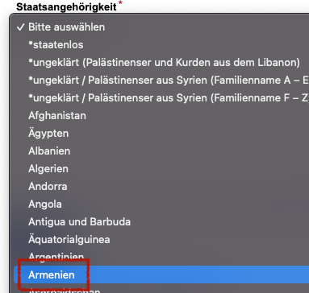

# Berlin Auslaenderbehorde Termin Bot

This application uses Selenium library to automate the process of getting an appointment in Berlin Ausländerbehörde.
Instead of notifying the person like other solutions, this application automatically **books** for you the requested *Termin*

## How to setup
1. In order to run selenium server you will need to install docket first. See [Get Docker](https://docs.docker.com/get-docker/) for more info.
    
2. Create a docker network 
   - `docker network create termin`
   
3. Start SeleniumHub server 
   - `source infra/init_seleniumgrid.sh`

4. Run Elasticsearch server[OPTIONAL]. 
   - `source infra/init_elasticsearch.sh`
   - If you don't need elasticsearch for log management, deactivate the elasticsearch appender in [log4j2.xml](src/main/resources/log4j2.xml)

## How to run
- Fill the [personInfoDTO.Json](src/main/resources/PERSONAL_INFO_FORM_default.json) file with your personal information
  - Write the Country value in German as displayed. 
- Fill the [visaFormTO.Json](src/main/resources/APPLY_FOR_A_RESIDENCE_TITLE_default.json) with your visa request.
  - You can also copy-paste from a template that matches your request
- Save the following environmental variables 
  - `export SELENIUM_GRID_HOST='localhost'`
  - `export ELASTICSEARCH_HOST='localhost'` [OPTIONAL]  
- Run the application in terminal by `./gradlew run`.
  - You will get the email from *LEA* once the bot booked the termin. 
  - REMEMBER: Due to very limited number of available spots, you might need to run the script for a week !

## TODO: How to deploy using AWS EC2 

- [ ] *t3.nano* failed.   Price: *$0.0052*
- [-] Running the selenium in *t2.medium* worked! Price  *$0.0464*
- t3a.micro worked only for selenium and finder. Not for elastic
- [x] **t3a.small**: Works
- t4g.micro was not available

Other recommendations
- t4g.small
- t4g.medium

docker exec -it 4c85e0506977 /bin/bash

## How to dockerize
- First create a fatjar `./gradlew shadowJar`
- Build the image `docker build --tag yilmaznaslan/berlinterminfinder:latest --file Dockerfile .`
- Push the image to a docker registery `docker push yilmaznaslan/berlinterminfinder:latest`

### Extra
- Connect to the containers shell `docker exec -ti 18b3d6e1415b /bin/bash`

## TODO: Kubernetes setup
`kubectl create -f infra/selenium-hub-deployment.yaml`