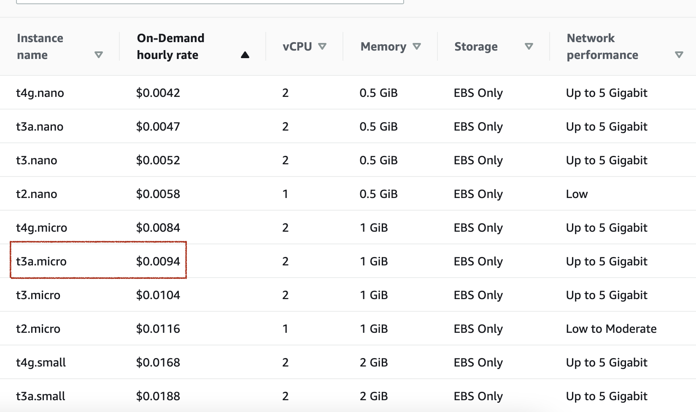

# Berlin Termin Bot

This application uses Selenium library to automate the process of getting an appointment in Berlin Ausländerbehörde.
Instead of notifying the person like other solutions, this application automatically **books** for you the requested *Termin* 

## Prerequisite
In order to run selenium server you will need to install docket first. See 
[Get Docker](https://docs.docker.com/get-docker/) for more info.

## How to setup
1. Run SeleniumHub 
   - `source infra/init_seleniumgrid.sh`

2. Run Elasticsearch(Optional) 
   - `source infra/init_elasticsearch.sh`
   - If you don't need elasticsearch for log management, deactivate the elasticsearch appender in [log4j2.xml](src/main/resources/log4j2.xml)

## How to run
- Fill the [personInfoDTO.Json](src/main/resources/personalInfoDTO.json) file with your personal information
- Fill the [residenceTitleInfoDTO.Json](src/main/resources/residenTitleInfoDTO.json)
  - You can also copy paste from a template that matches your request
- Run the application in terminal by `./gradlew run`.

## How to deploy using AWS EC2 

[ - ] *t3.nano* failed.   Price: *$0.0052*

- [-] Running the selenium in *t2.medium* worked! Price  *$0.0464*
- t3a.micro worked only for selenium and finder. Not for elastic

- [x] **t3a.small**: Works

- t4g.micro was not available

Other recommandations
- t4g.small
- t4g.medium

docker exec -it 4c85e0506977 /bin/bash

## How to dockerize

`docker build --tag 'yilmaznaslan/berlinterminfinder:latest' .`

docker build --tag yilmaznaslan/berlinterminfinder:latest --file DockerFileForDebian

docker build -t yilmaznaslan/berlinterminfinder:pi -f DockerfileForDebian .

`docker push yilmaznaslan/berlinterminfinder:latest`

`docker push yilmaznaslan/berlinterminfinder:pi`

`sudo docker run --name termifinder --network=termin yilmaznaslan/berlinterminfinder:latest`

docker exec -ti 18b3d6e1415b sh

## TODO: Kubernetes setup
`kubectl create -f infra/selenium-hub-deployment.yaml`